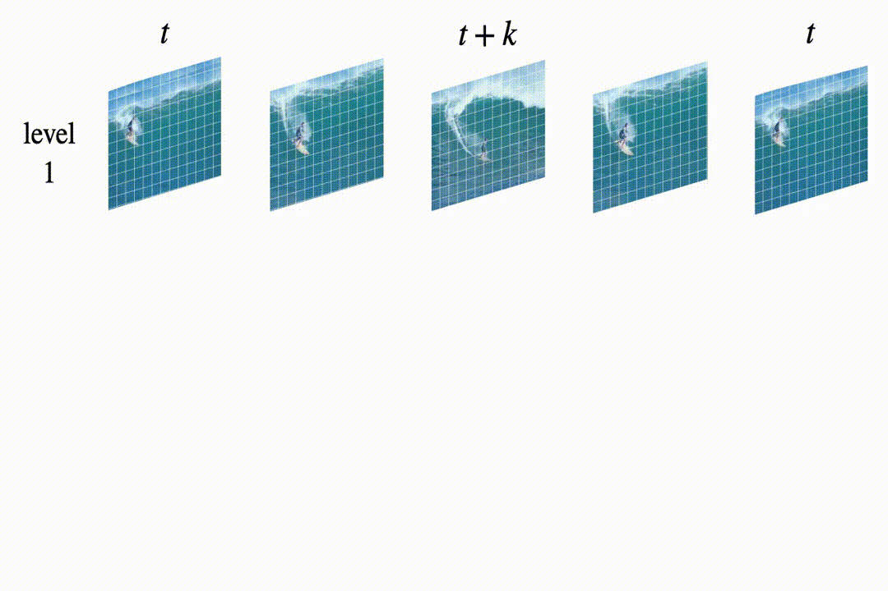
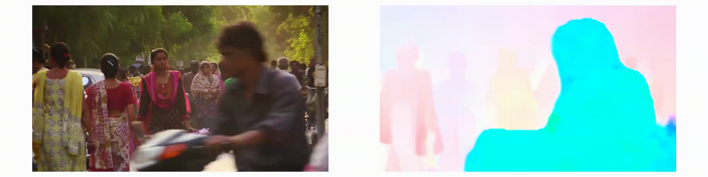

This repo is under construction.
# Learning Pixel Trajectories with Multiscale Contrastive Random Walks 
This is the repository for *Learning Pixel Trajectories with Multiscale Contrastive Random Walks*. 

<p align="center">

</p>

[[Paper](https://arxiv.org/abs/2201.08379)]
[[Bibtex](https://jasonbian97.github.io/flowwalk/resources/bibtex.txt)]

For any inquiries, please contact us at [jasonbian.zx@gmail.com](mailto:jasonbian.zx@gmail.com)

# Use Model 
## Label Propagation
TODO

## Estimate Optical Flow
run inference using pretrained model `*.ckpt`
```shell script
python inference.py --input_dir ./demo --pretrained_ckpt ./pretrained/opticalflow/sintel-pretrained.ckpt
```
To check if you run it successfully, check output "./demo/flow_movie.mp4"` and it should be something like:

<p align="center">

</p>

# Train
Docker is under construction.

# Citation
```shell script
@InProceedings{bian2022learning,
  title={Learning Pixel Trajectories with Multiscale Contrastive Random Walks},
  author={Bian, Zhangxing and Jabri, Allan and Efros, Alexei A. and Owens, Andrew},
  booktitle = {Proceedings of the IEEE/CVF Conference on Computer Vision and Pattern Recognition (CVPR)},
  month = {June},
  year={2022}  
}
```

# Acknowledgements
We thank for portions of the source code from some great works such as [ContrastiveRandomWalk](https://github.com/ajabri/videowalk), [PWC-net](https://github.com/NVlabs/PWC-Net), [ARflow](https://github.com/lliuz/ARFlow), [Uflow](https://github.com/google-research/google-research/tree/master/uflow), [RAFT](https://github.com/princeton-vl/RAFT).